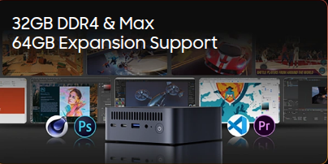

# Opción B — Mini PC ya montado (PASO 8)

Elige **1 Mini PC** ya montado y complétalo con enlaces y justificación.

## PASO 8 — Mini PC alternativo

**Producto elegido:** Mini PC

- **Marca y modelo exacto:** Blackview MP100
- **Precio (€):** 439€
- **URL tienda:** [Link](https://www.pccomponentes.com/blackview-mp100-mini-pc-amd-ryzen-7-5825u-16gb-512gb-ssd-negro)

**Ficha técnica oficial (obligatorio):**

- URL oficial del fabricante: [Especificaciones](https://www.blackview.hk/products/item/mp100)

**Especificaciones:**

- CPU: AMD Ryzen™ 7 5825U (8 núcleos / 16 hilos, hasta 4.5 GHz).
- RAM: 16GB DDR4
- SSD/almacenamiento: 512GB SSD M.2 NVMe.
- Conectividad: Wi-Fi 6, Bluetooth 5.2, Dual Ethernet, 4K Triple Display (HDMI+DP+Type-C).
- Tamaño / consumo: 127 x 127 x 45 mm / TDP 15W - 25W.

**Ventajas (mínimo 4):**

- Potencia: Tiene 8 nucleos fisicos, lo que supera al ryzen 5 de la opcion A
- Memoria: Trae 16GB de RAM de serie, el doble que la opcion A
- Pantallas: Permite conectar un total de 3 pantallas
- Portabilidad: Tiene una muy buena portabilidad, pudiendo llevartelo a cualquier sitio y pudiendo ocultarlo detras del monitor

**Contras (mínimo 4):**

- Precio mas elevado: Supera el presupuesto de la opcion A
- Reparabilidad: Si se estropea la placa base o el procesador, no se pueden sustituir como en la torre.
- Ruido bajo carga: Al tener un ventilador tan pequeño, puede volverse ruidoso cuando se le exige mucho trabajo.
- Fuente externa: Utiliza un transformador externo (tipo portátil) que suele estorbar en el suelo o escritorio.

**¿Para qué oficina SÍ / para qué NO?**

- Sí: Puestos de gestión de datos, edición de imagen/vídeo ligero, programación y oficinas con espacio muy reducido.
- No: Entornos donde se busque silencio absoluto (el ventilador se oye) o donde se planee añadir tarjetas gráficas en el futuro.

**Compatibilidad/ampliación (con enlaces):**

- ¿Se puede ampliar RAM? Sí, soporta hasta 64GB DDR4 mediante dos slots SO-DIMM.
- evidencia:
  
- ¿Se puede ampliar SSD? Sí, permite sustituir el M.2 y añadir un SSD SATA de 2.5" adicional.
- evidencia: 

## Comparación rápida A vs B

Rellena esta tabla:

| Aspecto                        | Opción A (por piezas)         | Opción B (Mini PC)                 |
| -------------------------------- | -------------------------------- | ------------------------------------- |
| Precio total                   | 401,72€                       | 439€                               |
| Rendimiento esperado (oficina) | Muy bueno (6 núcleos)         | Muy alto (8 núcleos)               |
| Ampliación (RAM/SSD)          | Muy Alta (Más puertos libres) | Buena (2 slots RAM + 2 Discos)      |
| Consumo/ruido/espacio          | Medio / Silencioso / Grande    | Muy Bajo / Algo ruidoso / Diminuto  |
| Facilidad de despliegue        | Baja (Requiere montaje)        | Muy buena (Sacar de la caja y usar) |
| Garantía/soporte              | Pieza a pieza (Varias marcas)  | Única (Blackview)                  |
