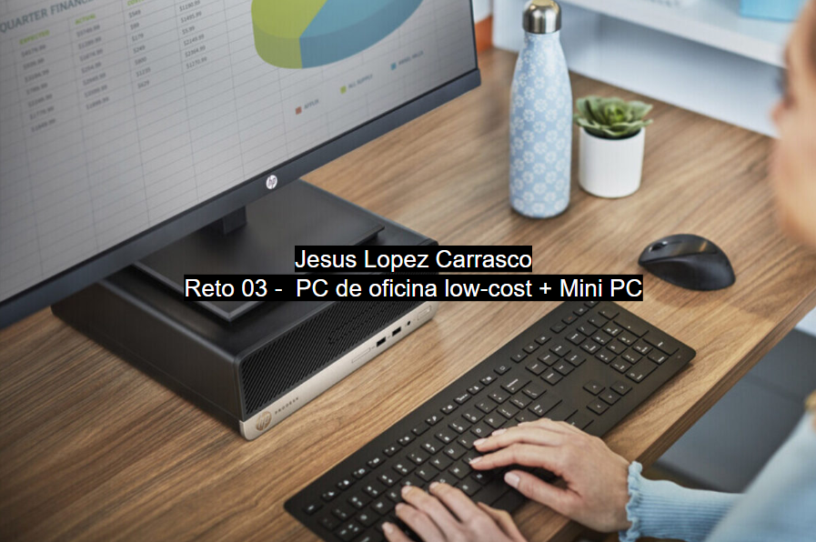

# ENTREGA ÚNICA — Reto 03 (UT3)

> Copia y pega aquí TODO lo necesario para exportar a PDF.

## 1) Portada

- **Módulo:** Fundamentos de Hardware (FHW)
- **Unidad:** UT3
- **Reto:** 03 — PC de oficina low-cost + Mini PC
- **Alumno/a:** Nombre Apellido1 Apellido2
- **Curso/Grupo:** 1º ASIR
- **Fecha:** 18/02/2026

## 2) Opción A — PC por piezas (PASO 1–7)

# Opción A — PC de oficina por piezas (PASO 1–7)

> Rellena cada paso usando la **plantilla**. Mantén el objetivo: **oficina**, precio ajustado y componentes razonables.

## PASO 1 — CPU con gráficos integrados

**Componente elegido:** Procesador

- **Marca y modelo:** AMD Ryzen 5 5600GT
- **Precio (€):** 139,90€
- **URL tienda:** [Link](https://www.pccomponentes.com/amd-ryzen-5-5600gt-36-46ghz-box?srsltid=AfmBOootK-J8tvoKPA0eyvItTAkt6xGUDxfroPscQXFSwzHThNNMeQDY)

**Ficha técnica oficial (obligatorio):**

- URL oficial: [Especificaciones](https://www.amd.com/es/support/downloads/drivers.html/processors/ryzen/ryzen-5000-series/amd-ryzen-5-5600gt.html)

**Características principales (resumen):**

- 6 núcleos / 12 hilos, frecuencia hasta 4.6GHz, gráficos Radeon Vega 7 integrados, TDP 65W.

**Justificación (oficina):**

- Es una buena opcion ya que tiene graficos integrados y ahorra el coste de una tarjeta grafica dedicada y sus 6 nucleos garantizan una fluidez en multitarea.

**Compatibilidad (obligatorio, con enlaces):**

- Compatibilidad clave 1: Socket AM4
  - Evidencia (URL): [Evidencias](https://www.amd.com/es/support/downloads/drivers.html/processors/ryzen/ryzen-5000-series/amd-ryzen-5-5600gt.html)
- Compatibilidad clave 2: Soporta memoria DDR4 3200MHz
  - Evidencia (URL): [Evidencias](https://www.amd.com/es/support/downloads/drivers.html/processors/ryzen/ryzen-5000-series/amd-ryzen-5-5600gt.html)

**Captura (opcional si tu profe lo exige):**

## PASO 2 — Placa base compatible

**Componente elegido:** Placa Base

- **Marca y modelo:** MSI A520M-A PRO
- **Precio (€):** 51,99€
- **URL tienda:** [Link](https://www.pccomponentes.com/msi-a520m-a-pro)

**Ficha técnica oficial (obligatorio):**

- URL oficial: [Especificaciones](https://es.msi.com/Motherboard/A520M-A-PRO/Specification)

**Características principales (resumen):**

- Chipset A520, formato Micro-ATX, ranura M.2 NVMe, salidas de vídeo HDMI/DVI.

**Justificación (oficina):**

- Es una placa base duradera y estable a un precio minimo, al ser destinada para un pc de oficina no necesitamos hacer overclocking y esta es una buena opcion.

**Compatibilidad (obligatorio, con enlaces):**

- Compatibilidad clave 1: Formato Micro-ATX compatible con chasis Nox Coolbay MX2.
  - Evidencia (URL): [Evidencias](https://www.nox-xtreme.com/cajas/coolbay-mx2)
- Compatibilidad clave 2: Ranura M.2 PCIe Gen3 para el SSD.
  - Evidencia (URL): [Evidencias](https://es.msi.com/Motherboard/A520M-A-PRO/Specification)

**Captura (opcional si tu profe lo exige):**

## PASO 3 — Memoria RAM (mínimo 8 GB)

**Componente elegido:** Memoria RAM

- **Marca y modelo:** Kingston FURY Beast DDR4 3200 MHz 8GB (1x8GB)
- **Precio (€):** 82,95€
- **URL tienda:** [Link](https://www.pccomponentes.com/kingston-fury-beast-ddr4-3200-mhz-8gb-cl16?srsltid=AfmBOorTZlV9o9nMgMeN-xRuWSZOwMU0lYnVMN_AX-81cfHbh2M4edwQ)

**Ficha técnica oficial (obligatorio):**

- URL oficial: [Especificaciones](https://www.kingston.com/datasheets/KF432C16BB_8.pdf)

**Características principales (resumen):**

- Capacidad 8GB, velocidad 3200 MT/s, Latencia CL16, Disipador de calor de perfil bajo.

**Justificación (oficina):**

- 8GB es el punto estandar para Windows 11 y aplicaciones de oficina y ofimatica, con 3200MHz es una velocidad

**Compatibilidad (obligatorio, con enlaces):**

- Compatibilidad clave 1: Tipo DDR4 soportado por la placa base.
  - Evidencia (URL): [Evidencias](https://es.msi.com/Motherboard/A520M-A-PRO/Specification)
- Compatibilidad clave 2: Voltaje 1.35V compatible con perfiles XMP.
  - Evidencia (URL): [Evidencias](https://www.kingston.com/datasheets/KF432C16BB_8.pdf)

**Captura (opcional si tu profe lo exige):**

## PASO 4 — Almacenamiento (SSD)

**Componente elegido:** Disco SSD M2

- **Marca y modelo:** Kingston NV2 500GB SSD NVMe PCIe 4.0
- **Precio (€):** 48,99€
- **URL tienda:** [Link](https://www.pccomponentes.com/kingston-nv2-500gb-ssd-pcie-40-nvme-gen-4x4)

**Ficha técnica oficial (obligatorio):**

- URL oficial: [Especificaciones](https://www.kingston.com/datasheets/SNV2S_es.pdf)

**Características principales (resumen):**

- 500GB de capacidad, interfaz NVMe PCIe Gen 4x4, lectura hasta 3500MB/s.

**Justificación (oficina):**

- 500GB para un pc de oficina es un espacio mas que suficiente, teniendo en cuenta que practicamente casi todo el mundo trabaja en la nube, tambien al ser un ssd m2 tiene un arranque rapido.

**Compatibilidad (obligatorio, con enlaces):**

- Compatibilidad clave 1: 1: Formato M.2 2280.
  - Evidencia (URL): [Evidencias](https://es.msi.com/Motherboard/A520M-A-PRO/Specification)

**Captura (opcional si tu profe lo exige):**

## PASO 5 — Fuente (PSU)

**Componente elegido:** Fuente de alimentacion

- **Marca y modelo:** MSI MAG A550BN 550W
- **Precio (€):** 49,90€
- **URL tienda:** [Link](https://www.pccomponentes.com/msi-mag-a550bn-550w-80-plus-bronze)

**Ficha técnica oficial (obligatorio):**

- URL oficial: [Especificaciones](https://es.msi.com/Power-Supply/MAG-A550BN/Specification)

**Características principales (resumen):**

- 550W de potencia, certificación 80 Plus Bronze, ventilador silencioso de 120mm.

**Justificación (oficina):**

- MSI es una marca fiable, 550W es mas que suficiente para este equipo.

**Compatibilidad (obligatorio, con enlaces):**

- Compatibilidad clave 1: Formato ATX estándar.
  - Evidencia (URL): [Evidencias](https://www.nox-xtreme.com/cajas/coolbay-mx2)

**Captura (opcional si tu profe lo exige):**

## PASO 6 — Chasis

**Componente elegido:** Chasis

- **Marca y modelo:** Nox Coolbay MX2
- **Precio (€):** 27,99€
- **URL tienda:** [Link](https://www.pccomponentes.com/nox-coolbay-mx2-usb-30-negro?srsltid=AfmBOorfANd_wvlRHXdxLUdVdKMmG5WwfZ4tKiGnIMsPumBk2u7Z3nec)

**Ficha técnica oficial (obligatorio):**

- URL oficial: [Especificaciones](https://www.nox-xtreme.com/cajas/coolbay-mx2)

**Características principales (resumen):**

- Formato Mini Tower, acabado elegante en negro cepillado, 1 ventilador de 120mm incluido, soporte Micro-ATX.

**Justificación (oficina):**

- Un diseño normal para oficina, sin luces, compacta para que ocupe poco espacio, ya se ponga en la mesa o en el suelo.

**Compatibilidad (obligatorio, con enlaces):**

- Compatibilidad clave 1: Soporta placas bases de formato Micro-ATX.
  - Evidencia (URL): [Evidencias](https://www.nox-xtreme.com/cajas/coolbay-mx2)

**Captura (opcional si tu profe lo exige):**

## PASO 7 — Presupuesto final

- Suma total de la Opción A (por piezas).
- Justifica si priorizas precio, consumo o posibilidad de ampliación.
- Incluye una mini tabla resumen.

Plantilla sugerida:

| Componente | Modelo                                    |  Precio (€) | URL tienda                                                                                                                                        |
| ------------ | ------------------------------------------- | -------------: | --------------------------------------------------------------------------------------------------------------------------------------------------- |
| CPU        | AMD Ryzen 5 5600GT                        |     139,90€ | [Link](https://www.pccomponentes.com/amd-ryzen-5-5600gt-36-46ghz-box?srsltid=AfmBOootK-J8tvoKPA0eyvItTAkt6xGUDxfroPscQXFSwzHThNNMeQDY)            |
| Placa base | MSI A520M-A PRO                           |      51,99€ | [Link](https://www.pccomponentes.com/msi-a520m-a-pro)                                                                                             |
| RAM        | RAM Kingston FURY Beast DDR4 3200 MHz 8GB |      82,95€ | [Link](https://www.pccomponentes.com/kingston-fury-beast-ddr4-3200-mhz-8gb-cl16?srsltid=AfmBOorTZlV9o9nMgMeN-xRuWSZOwMU0lYnVMN_AX-81cfHbh2M4edwQ) |
| SSD        | Kingston NV2 500GB SSD                    |      48,99€ | [Link](https://www.pccomponentes.com/kingston-nv2-500gb-ssd-pcie-40-nvme-gen-4x4)                                                                 |
| PSU        | MSI MAG A550BN 550W                       |      49,90€ | [Link](https://www.pccomponentes.com/msi-mag-a550bn-550w-80-plus-bronze)                                                                          |
| Chasis     | Nox Coolbay MX2                           |      27,99€ | [Link](https://www.pccomponentes.com/nox-coolbay-mx2-usb-30-negro?srsltid=AfmBOorfANd_wvlRHXdxLUdVdKMmG5WwfZ4tKiGnIMsPumBk2u7Z3nec)               |
| **TOTAL**  |                                           | **401,72€** |                                                                                                                                                   |

## 3) Opción B — Mini PC (PASO 8)

# Opción B — Mini PC ya montado (PASO 8)

Elige **1 Mini PC** ya montado y complétalo con enlaces y justificación.

## PASO 8 — Mini PC alternativo

**Producto elegido:** Mini PC

- **Marca y modelo exacto:** Blackview MP100
- **Precio (€):** 439€
- **URL tienda:** [Link](https://www.pccomponentes.com/blackview-mp100-mini-pc-amd-ryzen-7-5825u-16gb-512gb-ssd-negro)

**Ficha técnica oficial (obligatorio):**

- URL oficial del fabricante: [Especificaciones](https://www.blackview.hk/products/item/mp100)

**Especificaciones:**

- CPU: AMD Ryzen™ 7 5825U (8 núcleos / 16 hilos, hasta 4.5 GHz).
- RAM: 16GB DDR4
- SSD/almacenamiento: 512GB SSD M.2 NVMe.
- Conectividad: Wi-Fi 6, Bluetooth 5.2, Dual Ethernet, 4K Triple Display (HDMI+DP+Type-C).
- Tamaño / consumo: 127 x 127 x 45 mm / TDP 15W - 25W.

**Ventajas (mínimo 4):**

- Potencia: Tiene 8 nucleos fisicos, lo que supera al ryzen 5 de la opcion A
- Memoria: Trae 16GB de RAM de serie, el doble que la opcion A
- Pantallas: Permite conectar un total de 3 pantallas
- Portabilidad: Tiene una muy buena portabilidad, pudiendo llevartelo a cualquier sitio y pudiendo ocultarlo detras del monitor

**Contras (mínimo 4):**

- Precio mas elevado: Supera el presupuesto de la opcion A
- Reparabilidad: Si se estropea la placa base o el procesador, no se pueden sustituir como en la torre.
- Ruido bajo carga: Al tener un ventilador tan pequeño, puede volverse ruidoso cuando se le exige mucho trabajo.
- Fuente externa: Utiliza un transformador externo (tipo portátil) que suele estorbar en el suelo o escritorio.

**¿Para qué oficina SÍ / para qué NO?**

- Sí: Puestos de gestión de datos, edición de imagen/vídeo ligero, programación y oficinas con espacio muy reducido.
- No: Entornos donde se busque silencio absoluto (el ventilador se oye) o donde se planee añadir tarjetas gráficas en el futuro.

**Compatibilidad/ampliación (con enlaces):**

- ¿Se puede ampliar RAM? Sí, soporta hasta 64GB DDR4 mediante dos slots SO-DIMM.
- evidencia:
  
- ¿Se puede ampliar SSD? Sí, permite sustituir el M.2 y añadir un SSD SATA de 2.5" adicional.
- evidencia: 

## Comparación rápida A vs B

Rellena esta tabla:

| Aspecto                        | Opción A (por piezas)         | Opción B (Mini PC)                 |
| -------------------------------- | -------------------------------- | ------------------------------------- |
| Precio total                   | 401,72€                       | 439€                               |
| Rendimiento esperado (oficina) | Muy bueno (6 núcleos)         | Muy alto (8 núcleos)               |
| Ampliación (RAM/SSD)          | Muy Alta (Más puertos libres) | Buena (2 slots RAM + 2 Discos)      |
| Consumo/ruido/espacio          | Medio / Silencioso / Grande    | Muy Bajo / Algo ruidoso / Diminuto  |
| Facilidad de despliegue        | Baja (Requiere montaje)        | Muy buena (Sacar de la caja y usar) |
| Garantía/soporte              | Pieza a pieza (Varias marcas)  | Única (Blackview)                  |

## 4) Checklist de compatibilidad

Piensa en esto como un **“enchufe y llaves”**:

- El **socket** es la “cerradura” de la placa base.
- La **CPU** es la “llave”.
  Si no coincide, no entra.

Rellena con ✅ + enlaces de evidencia.

## Opción A (por piezas)

| Compatibilidad                                      | Evidencia (enlace)                                                           | OK |
| ----------------------------------------------------- | ------------------------------------------------------------------------------ | :--: |
| CPU ↔ Placa base (socket/chipset soportado)        | [Especificaciones](https://es.msi.com/Motherboard/A520M-A-PRO/Specification) | ✅ |
| RAM ↔ Placa base (DDR4/DDR5, velocidad soportada)  | [Especificaciones](https://es.msi.com/Motherboard/A520M-A-PRO/Specification) | ✅ |
| SSD ↔ Placa base (SATA o M.2; NVMe vs SATA)        | [Especificaciones](https://es.msi.com/Motherboard/A520M-A-PRO/Specification) | ✅ |
| PSU ↔ Placa base (24-pin ATX, EPS 8-pin si aplica) | [Especificaciones](https://es.msi.com/Motherboard/A520M-A-PRO/Specification) | ✅ |
| Chasis ↔ Placa base (ATX/mATX/ITX)                 | [Especificaciones](https://es.msi.com/Motherboard/A520M-A-PRO/Specification) | ✅ |
| Chasis ↔ PSU (ATX/SFX/TFX)                         | [Especificaciones](https://es.msi.com/Power-Supply/MAG-A550BN/Specification) | ✅ |

## Opción B (Mini PC)

| Punto a verificar                          | Evidencia (enlace)                                               | OK |
| -------------------------------------------- | ------------------------------------------------------------------ | :--: |
| RAM ampliable (sí/no, máximo)            | [Especificaciones](https://www.blackview.hk/products/item/mp100) | ✅ |
| SSD ampliable (sí/no, M.2/SATA)           | [Especificaciones](https://www.blackview.hk/products/item/mp100) | ✅ |
| Conectividad (Wi‑Fi/Ethernet/USB/HDMI/DP) | [Especificaciones](https://www.blackview.hk/products/item/mp100) | ✅ |

## 5) Conclusión final

- ¿Qué opción elegirías para una oficina real y por qué?

Elegiría la Opción B porque, por una pequeña diferencia de precio, ofrece mayor potencia (Ryzen 7), más memoria RAM (16GB) y un despliegue inmediato sin necesidad de montaje. Su diseño compacto y capacidad para tres pantallas la hacen ideal para la productividad en entornos de trabajo modernos.

- ¿Qué has aprendido sobre **compatibilidad**?

He aprendido que la compatibilidad va más allá de encajar piezas físicas; implica asegurar que el hardware soporte las demandas del software actual (como el tipo de memoria y almacenamiento NVMe) y que las dimensiones del chasis permitan la refrigeración y ampliación necesarias.
